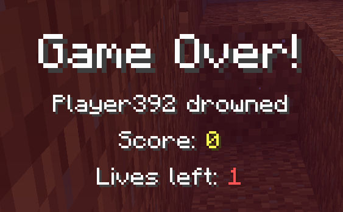

# Multiplayer Hardcore

A Minecraft Fabric 1.21 mod that gives you multiple lives in hardcore.\
Best suited for Multiplayer servers.

## Installation and usage

Mod is **required** on server, and **optional** on client.\
Clients without the mod will see player's lives in player list differently (scoreboard hearts), and will not see remaining lives on death screen.

This mod requires Fabric API.

## Config

- `defaultLives` - Default amount of lives given to a new player. Also affects minimum heart count in player list.
- `maxRescueTimes` - Max amount of times admin (op level 1+) can execute `/hardcore rescue`

## Commands

- `/hardcore set_lives [playername] [count]` - Set *playername*'s lives to *count*. Works on offline players and `@a`. Requires op level 1+
- `/hardcore get_lives [playername]` - Get *playername*'s remaining lives. Works on offline players and `@a` (lists all players). Requires op level 1+
- `/hardcore rescue [playername]` - If *playername* has used all their lives, using this command player will be given 1 additional life, and respawned on world spawn (even if player has bed - respawn will happen on world spawn). Max amount of times this can be used on a player is defined using `maxRescueTimes` config parameter. Requires op level 1+
- `/hardcore reset_rescue [playername]` - Reset `rescue` counter for *playername*. Requires op level 4

## Features

- Remaining lives of players are displayed as hardcore hearts in player list (if client mod is installed)

- Remaining lives of players are displayed as scoreboard hearts in player list (if client mod is not installed), additional scoreboard displayed in player list is not supported

- Remaining player lives are displayed on death screen (if client mod is installed)

- Hardcore state is forced from server.properties (doesn't require to edit or recreate world anymore)

## License

[MIT](LICENSE)